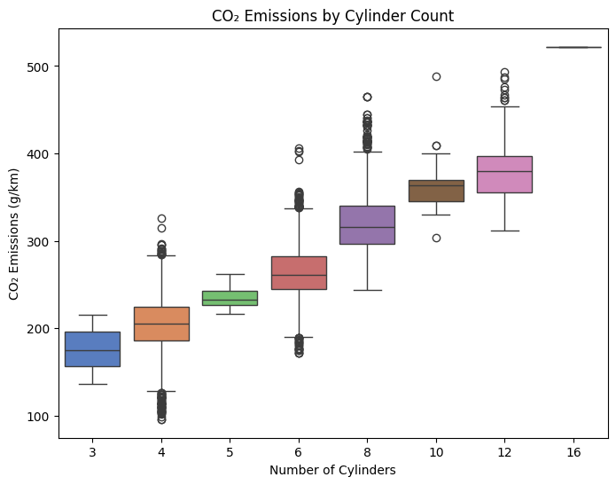
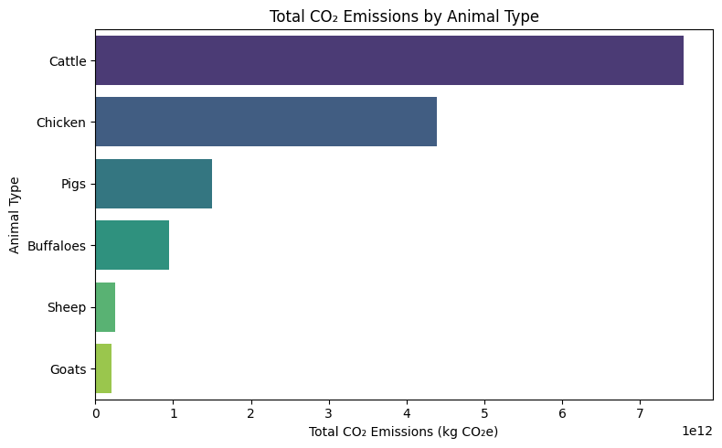
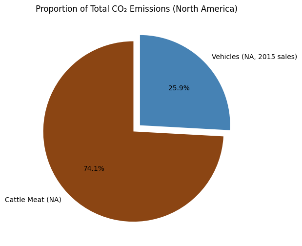
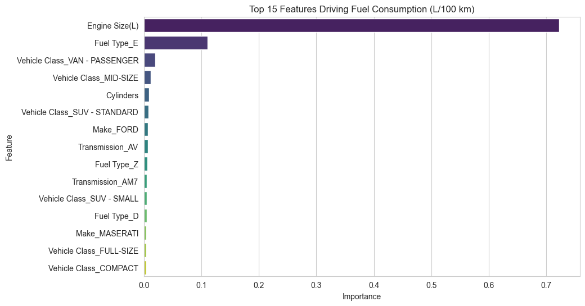
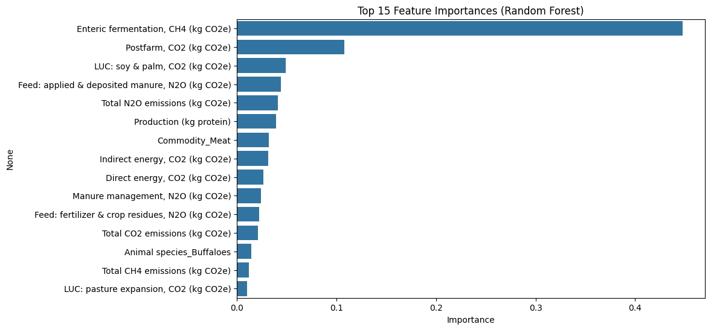

# Repository: Emissions Analysis, Livestock vs Vehicles
#### Developer: Derek Fintel
#### Contact: s542635@nwmissouri.edu

## Repository Overview
This repository captures the technical analysis utilized in a capstone project called "Emissions Analysis, Livestock vs Vehicles". The capstone project is part of a Masters of Science Data Analytics program through Northest Missouri State University. This project employs various data science and analytics methods against a problem domain.

### Final Capstone Report Link: https://www.overleaf.com/read/rrpbnffjgngk#d6ef5d

### Capstone Abstract
*This study applied data science and machine learning techniques to compare and analyze greenhouse gas emissions from livestock production and vehicle usage. By conforming disparate datasets and performing regression and clustering analyses, the research quantified the relative emissions impact of cattle meat production and vehicle travel. The findings demonstrate that livestock-related emissions substantially exceed those from vehicle use under comparable annual activity assumptions providing insights into how diet and transportation choices may influence climate impact.*

# Source Data:
This project utilized two separate datasets, sourced from [Kaggle](https://www.kaggle.com/). Both native CSV files have been brought into this project.

Livestock Dataset: https://www.kaggle.com/datasets/amandaroseknudsen/gleamlivestockemissions

Vehicle Dataset: https://www.kaggle.com/datasets/brsahan/vehicle-co2-emissions-dataset

# Notebooks:
The project is supported by the execution of 5 Jupyter Notebooks that individually contributed to the final results. See below for their listing and description.
1) [emissions_analysis_livestock.ipynb](https://vscode.dev/github/dfintel25/Emissions_Analysis_Capstone/blob/main/notebooks/emissions_analysis_livestock.ipynb) | An individual Exploratory Data Analysis of the Livestock source CSV data.
2) [emissions_analysis_vehicle.ipynb](https://vscode.dev/github/dfintel25/Emissions_Analysis_Capstone/blob/main/notebooks/emissions_analysis_vehicle.ipynb) | An individual Exploratory Data Analysis of the Vehicle source CSV data.
3) [emission_comparison.ipynb](https://vscode.dev/github/dfintel25/Emissions_Analysis_Capstone/blob/main/notebooks/emission_comparison.ipynb) | A comparitive analysis of both the Livestock and Vehicle datasets.
4) [livestock_emissions_ML.ipynb](https://vscode.dev/github/dfintel25/Emissions_Analysis_Capstone/blob/main/notebooks/livestock_emissions_ML.ipynb) | An individual Machine Learning Analysis of select Livestock data features.
5) [vehicle_emissions_ML.ipynb](https://vscode.dev/github/dfintel25/Emissions_Analysis_Capstone/blob/main/notebooks/vehicle_emissions_ML.ipynb) | An individual Machine Learning Analysis of select Vehicle data features.

# Machine Learning Results
**Vehicle Dataset:**
- R^2 Score: 0.9964
- RMSE: 3.51 g/km

**Livestock Dataset:**
- R^2 Score: 0.8499
- RMSE: 39.80 g/km

**Interpretation:**
- The Vehicle model is accurate enough to explain **99.64** percent of the variance with an average error of **3.51g/km** of CO2.
- The Livestock model is accurate enough to explain **85** percent of the variance with an average error of **39.80 kg** of CO2.

# Notebook Results
**Finding #1** - Individual Vehicle Dataset analysis; *Number of Cylinders* per engine contributed to higher CO2 readings.


**Finding #2** - Individual Livestock Dataset analysis; *Cattle* had the highest correlation to CO2 emissions.


**Finding #3** - Comparative Results; *Cattle Meat* production was 2.86x more CO2 polluting than cars.


**Finding #4** - Individual Vehicle Dataset Machine Learning; Analysis confirmed *Engine Size* was the most significant contributing feature.


**Finding #5** - Individual Livestock Dataset Machine Learning; *Enteric Fermentation* (methane from cow digestion) was the highest contributing feature.


# Report Conclusion
Our project confirmed our thesis in identifying and measuring the comparative emissions of livestock production and vehicle usage. Our results show that Cattle Meat production for one year is **2.86x more CO2 polluting** than if all vehicles sold in North America drove 10,000 miles within that same year.

Additionally, *Enteric Fermentation* from Cattle (digestive methane byproduct) is the strongest contributor from livestock production and *Engine Size* (along with cylinder-count) is the strongest contributor to vehicle use emissions. This provides insights into individual and collective choices where adjusting ones usage and consumption of the related topics could have a significant impact on our climate.

# Preliminary Setup Steps

### 1. Initialize
```
1. Click "New Repository"
    a. Generate name with no spaces
    b. Add a "README.md"
2. Clone Repository to machine via VS Code
    a. Create folder in "C:\Projects"
3. Install requirements.txt
4. Setup gitignore
5. Test example scripts in .venv
```
### 2. Create Project Virtual Environment
```
py -m venv .venv
.venv\Scripts\Activate
py -m pip install --upgrade pip
py -m pip install -r requirements.txt
Retrieve installed items: !pip list
```
### 3. Git add, clone, and commit
```
git add .
git clone "urlexample.git"
git commit -m "add .gitignore, cmds to readme"
git push -u origin main
```
### 4. If copying a repository:
```
1. Click "Use this template" on this example repository (if it's not a template, click "Fork" instead).
2. Clone the repository to your machine:
   git clone example-repo-url
3. Open your new cloned repository in VS Code.
```
### 5. Detailed Project Setup
```
For additional setup details, see [SET_UP_Workflow.md](https://vscode.dev/github/dfintel25/Emissions_Analysis_Capstone/blob/main/SET_UP_Workflow.md)
```

# References
```
Knudsen, Amanda Rose. **GLEAM Livestock Emissions Dataset (Kaggle)**.
https://www.kaggle.com/datasets/amandaroseknudsen/gleamlivestockemissions
Accessed October 24, 2025.

Food and Agriculture Organization of the United Nations (FAO). **Global Livestock Environmental Assessment Model (GLEAM) — FAQs**.
https://www.fao.org/gleam/faqs/en/
Accessed October 24, 2025.

International Energy Agency. **EV Life Cycle Assessment Calculator** (2025).
https://www.iea.org/data-and-statistics/data-tools/ev-life-cycle-assessment-calculator
Accessed October 24, 2025.

Mai, L., Liu, M., Hao, H., Sun, X., Meng, F., Geng, Y., Zhao, F. (2025).
**A high-resolution dataset on electric passenger vehicle characteristics in China and the European Union.** *Scientific Data*, 12(1449).
https://www.nature.com/articles/s41597-025-05770-7

Livestock Data for Decisions. **Livestock and Greenhouse Gas Emissions** (2025).
https://livestockdata.org/resources/livestock-and-greenhouse-gas-emissions
Accessed October 24, 2025.

Batuhan, S. **Vehicle CO₂ Emissions Dataset** (2024).
https://www.kaggle.com/datasets/brsahan/vehicle-co2-emissions-dataset/data
Accessed October 24, 2025.

MarkLines Information Platform. **Flash Report, Sales Volume, 2015** (2016).
https://www.marklines.com/en/statistics/flash_sales/salesfig_usa_2015
Accessed October 24, 2025.
